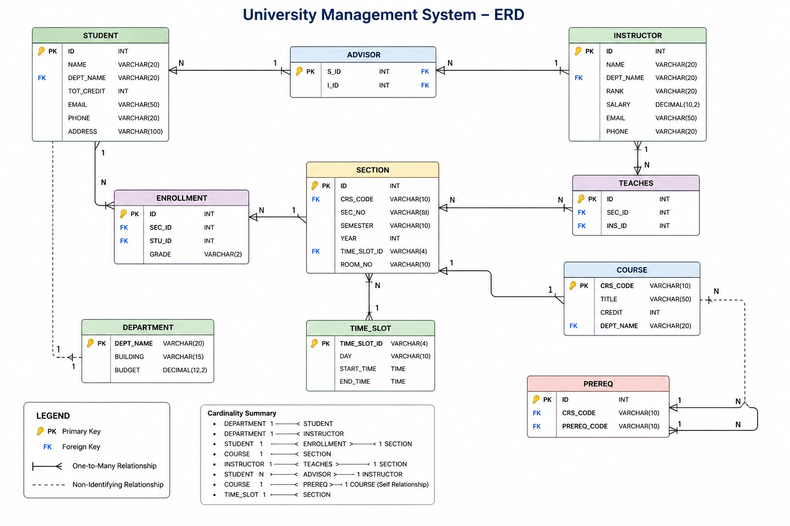

# 🎓 University Database Management System

A desktop-based University Database Management System developed using **Python**, **Tkinter / ttkbootstrap**, and **MySQL**.

This project was developed as the final project for the **Database Design** course and is based on the standard university database schema presented in the book *Database System Concepts*.

---

## 📌 Project Objectives

The main goals of this project are:

- Implement a functional university database application.
- Use the standard university database schema.
- Apply SQL concepts from Chapters 3, 4, and 5.
- Perform CRUD operations on database tables.
- Demonstrate interaction between Python and MySQL.
- Apply JOIN, GROUP BY, aggregation functions, and reporting.
- Provide a user-friendly graphical interface.

---

# 🛠 Technologies Used

### Programming Language

- Python 3.x

### GUI Framework

- Tkinter
- ttkbootstrap

### Database

- MySQL

### Database Connectivity

- mysql-connector-python

---

# 📁 Project Structure

University_Management_System/
│
├── .venv/                     # Virtual environment and installed libraries
│
├── __pycache__/               # Python bytecode cache files
│
├── src/                       # Core modules of the university system
│   │
│   ├── __pycache__/           # Bytecode cache for src modules
│   │
│   ├── advanced_query.py      # Advanced SQL queries and reports
│   ├── advisor.py             # Student-advisor relationship management
│   ├── course.py              # Course information management
│   ├── enrollment.py          # Student enrollment and registration management
│   ├── instructor.py          # Instructor information management
│   ├── prereq.py              # Course prerequisite management
│   ├── section.py             # Course section offerings management
│   ├── student.py             # Student information management
│   └── teaches.py             # Instructor course teaching management
│
├── database.py                # Database connection and SQL execution
│
├── requirement.txt            # Project dependencies and libraries
│
├── README.md                  # Project documentation
│
├── 1.png                      # Application screenshot
│
└── university_management.py   # Main application entry point and GUI

---

# 📂 Database Tables

The project uses the standard university database schema:

| Table |
|---------|
| student |
| instructor |
| department |
| course |
| section |
| takes |
| teaches |
| advisor |
| prereq |

---

# 🎨 User Interface

The application provides a modern desktop interface built with **ttkbootstrap**.

Modules available in the system:

- Dashboard
- Students
- Courses
- Instructors
- Enrollments
- Sections
- Teaches
- Prerequisites
- Advisors
- Reports

---

# 👨‍🎓 Student Management

Operations supported:

### Read

```sql
SELECT * FROM student
```

### Add

```sql
INSERT INTO student(id,name,dept_name,tot_cred)
VALUES (%s,%s,%s,%s)
```

### Update

```sql
UPDATE student
SET name=%s,
    dept_name=%s,
    tot_cred=%s
WHERE id=%s
```

### Delete

```sql
DELETE FROM student
WHERE id=%s
```

### Filter

Search students by department.

---

# 📚 Course Management

Operations supported:

### Read

```sql
SELECT * FROM course
```

### Add

```sql
INSERT INTO course(course_id,title,dept_name,credits)
VALUES (%s,%s,%s,%s)
```

### Update

```sql
UPDATE course
SET title=%s,
    credits=%s
WHERE course_id=%s
```

### Delete

```sql
DELETE FROM course
WHERE course_id=%s
```

### Filter

Search courses by department.

---

# 👩‍🏫 Instructor Management

Operations supported:

### Read

```sql
SELECT * FROM instructor
```

### Add

```sql
INSERT INTO instructor(id,name,dept_name,salary)
VALUES (%s,%s,%s,%s)
```

### Update

```sql
UPDATE instructor
SET name=%s,
    salary=%s
WHERE id=%s
```

### Delete

```sql
DELETE FROM instructor
WHERE id=%s
```

### Filter

Search instructors by department.

---

# 📋 Enrollment Management

Uses the **takes** table.

Operations supported:

### Read

```sql
SELECT * FROM takes
```

### Add

```sql
INSERT INTO takes
(id,course_id,sec_id,semester,year,grade)
VALUES (%s,%s,%s,%s,%s,%s)
```

### Update

```sql
UPDATE takes
SET grade=%s
WHERE id=%s
AND course_id=%s
```

### Delete

```sql
DELETE FROM takes
WHERE id=%s
AND course_id=%s
```

---

# 🏫 Section Management

Uses the **section** table.

Operations supported:

### Read

```sql
SELECT * FROM section
```

### Add

```sql
INSERT INTO section
(course_id,sec_id,semester,year,
building,room_number,time_slot_id)
VALUES (%s,%s,%s,%s,%s,%s,%s)
```

### Update

```sql
UPDATE section
SET room_number=%s,
    building=%s,
    time_slot_id=%s
WHERE course_id=%s
AND sec_id=%s
AND semester=%s
AND year=%s
```

### Delete

```sql
DELETE FROM section
WHERE course_id=%s
AND sec_id=%s
AND semester=%s
AND year=%s
```

### Student Enrollment Lookup

```sql
SELECT s.id,s.name
FROM student s
JOIN takes t
ON s.id=t.id
JOIN section s2
ON s2.course_id=t.course_id
AND s2.sec_id=t.sec_id
AND s2.semester=t.semester
AND s2.year=t.year
```

---

# 📖 Teaches Management

Uses the **teaches** table.

Operations supported:

### Read

```sql
SELECT * FROM teaches
```

### Add

```sql
INSERT INTO teaches
(id,course_id,sec_id,semester,year)
VALUES (%s,%s,%s,%s,%s)
```

### Delete

```sql
DELETE FROM teaches
WHERE id=%s
AND course_id=%s
```

### Search

```sql
SELECT *
FROM teaches
WHERE id=%s
```

---

# 📚 Prerequisite Management

Uses the **prereq** table.

Operations supported:

### Read

```sql
SELECT * FROM prereq
```

### Add

```sql
INSERT INTO prereq(course_id,prereq_id)
VALUES (%s,%s)
```

### Update

```sql
UPDATE prereq
SET prereq_id=%s
WHERE course_id=%s
```

### Delete

```sql
DELETE FROM prereq
WHERE course_id=%s
```

### Search

```sql
SELECT *
FROM prereq
WHERE course_id=%s
```

---

# 👨‍🏫 Advisor Management

Uses the **advisor** table.

Operations supported:

### Read

```sql
SELECT * FROM advisor
```

### Add

```sql
INSERT INTO advisor(s_id,i_id)
VALUES (%s,%s)
```

### Update

```sql
UPDATE advisor
SET i_id=%s
WHERE s_id=%s
```

### Delete

```sql
DELETE FROM advisor
WHERE s_id=%s
```

### Search

```sql
SELECT *
FROM advisor
WHERE i_id=%s
```

---

# 📊 Reports

The system provides analytical reports using SQL joins, grouping, and aggregation.

---

## Students With Grade A

```sql
SELECT s.id,
       s.name,
       s.dept_name,
       c.course_id,
       c.title,
       t.grade
FROM student s
JOIN takes t
ON s.id=t.id
JOIN course c
ON t.course_id=c.course_id
WHERE t.grade='A'
```

---

## Number of Students and Courses per Department

```sql
WITH course_count AS (...)
WITH student_count AS (...)
```

Uses:

- COUNT()
- GROUP BY
- JOIN

---

## Instructor Teaching Statistics

```sql
SELECT i.id,
       i.name,
       COUNT(t.course_id),
       SUM(c.credits)
FROM instructor i
JOIN teaches t
ON i.id=t.id
JOIN course c
ON t.course_id=c.course_id
GROUP BY i.id
```

Uses:

- COUNT()
- SUM()
- GROUP BY

---

# 🚀 Installation

Clone the repository:

```bash
git clone <repository-url>
```

Create a virtual environment:

```bash
python -m venv .venv
```

Activate virtual environment:

### Windows

```bash
.venv\Scripts\activate
```

Install dependencies:

```bash
pip install mysql-connector-python
pip install ttkbootstrap
pip install pillow
```

Run application:

```bash
python main.py
```

---

# 📖 Database Concepts Covered

### Chapter 3

- SELECT
- INSERT
- UPDATE
- DELETE

### Chapter 4

- JOIN
- GROUP BY
- Aggregation Functions
- Reporting

### Chapter 5

- Python ↔ MySQL Connectivity
- SQL Execution Through Host Language

---

# 👨‍💻 Author

Ali-Arezoomandi 
📧 Contact: [ali.arezoomandi1723.email@example.com] & [komeilahankoobi@gmail.com] 💻 GitHub: https://github.com/Ali-Arezoomandi

Database Design Course Final Project

University Database Management System

---

## 🖥️ Application Screenshot

